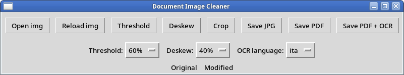

# Document Image Cleaner

**A lightweight, Linux-friendly Python GUI tool to clean up scanned documents.**  
Supports threshold adjustment, deskewing, cropping, and OCR conversion with Tesseract and OCRmyPDF.

 <!-- (optional image) -->

---

## ✨ Features

- Open, reload and preview images (drag & drop supported)
- Threshold adjustment (grayscale binarization)
- Deskew images to correct rotations
- Trim white borders (crop)
- Save as JPG or PDF
- Save as OCR'd PDF (with selectable text)
- Select OCR language (Italian, English, German)
- Clean interface using `tkinter` and `Pillow`

---

## 🧩 Dependencies

Make sure the following are installed:

- Python 3
- `tkinter` (`sudo apt install python3-tk`)
- `python3-tkinterdnd2` (`pip install tkinterdnd2`)
- `Pillow` (`pip install pillow`)
- `Tesseract OCR` (`sudo apt install tesseract-ocr`)
- `OCRmyPDF` (`sudo apt install ocrmypdf`)
- `ImageMagick` (`sudo apt install imagemagick`)
- Tesseract language packs:  
  `sudo apt install tesseract-ocr-ita tesseract-ocr-eng tesseract-ocr-deu`

---

## 🚀 Usage

```bash
python3 document_image_cleaner.py

